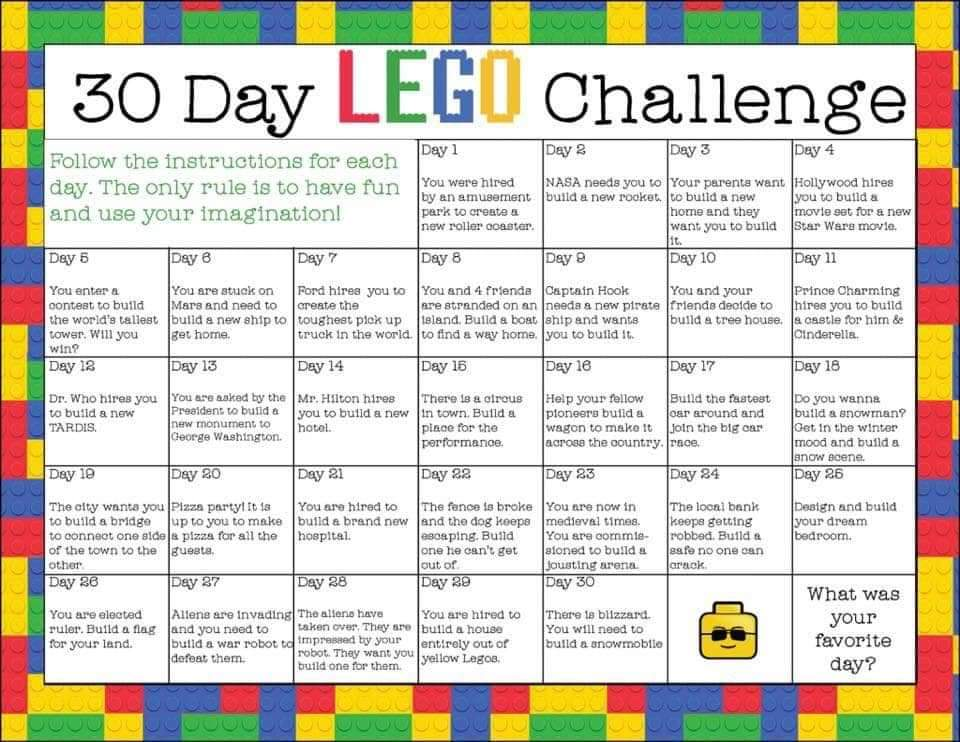

This page needs more content!

## General thoughts
Lots of board games, library books (and Kindle), tinkering/upcycling with household junk, etc.

## Little cooks kits!

https://www.littlecooksco.co.uk/

## Audible children's  books for free

https://stories.audible.com/start-listen?utm_campaign=audible+stories+free+children%27s+audiobooks&utm_medium=&utm_source=linktree

## Virtual Lego Game

